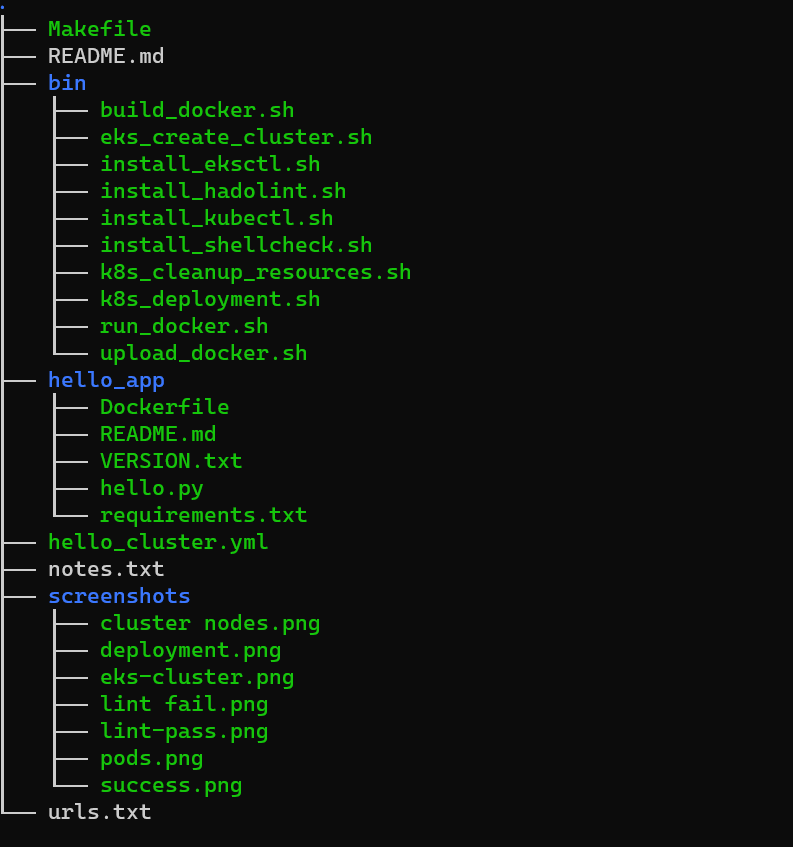
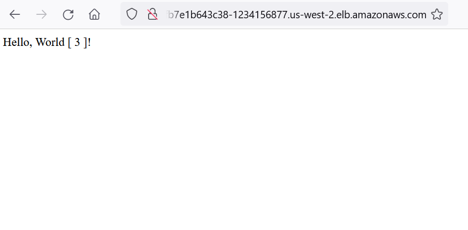

## Udacity AWS DevOps Engineer Capstone Project ~ Reema

## Introduction 
This project is part of the requirement to successfully graduate from the __Udacity__ *Nanodegree* for _Cloud DevOps_. 
In this project a simple python/flask app is operationalized using CircleCI and a Kubernetes(K8S) cluster deployed in AWS EKS.

- In a CircleCI pipeline, we lint the project's code, build a Docker image and deploy it to a public Docker Registry: Docker Hub
- Then in an AWS EKS cluster, we run the application Later, we promote to production a new app version using a `rolling update strategy`

## SetUp
1. Create Cluster
Run the `./bin/eks_create_cluster.sh` script when logged in to your ecs server.

## Project Structure

## Verifying
### Get link to the application
`$ kubectl get services -l app=capstone --output jsonpath='{.items[].status.loadBalancer.ingress[].hostname}' `
With the link that is generted, paste it to your browser URL, output looks like.\
